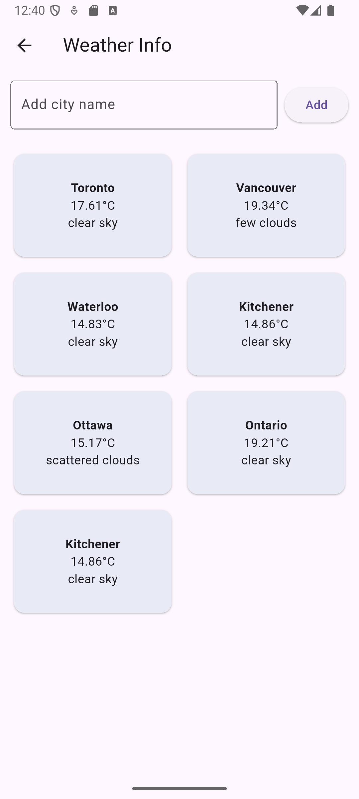
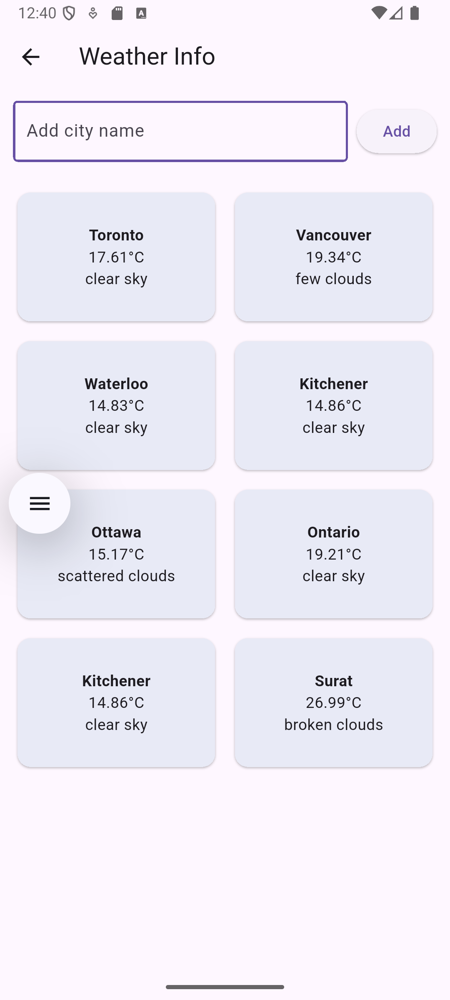

# InfoStream - Flutter App

A sleek and dynamic Flutter app that displays weather data and news from public APIs using GridView and ListView.

---

## 🔗 GitHub Repository
[https://github.com/dhruvjivani/InfoStream](https://github.com/dhruvjivani/InfoStream)

---

## 🔧 How to Build and Run

1. Clone the repository:
   ```bash
   git clone https://github.com/dhruvjivani/InfoStream.git
   cd InfoStream
   ```
2. Run:
   ```bash
   flutter pub get
   flutter run
   ```
3. Replace `YOUR_API_KEY` in `weather_service.dart` and `news_service.dart` with actual API keys.

---

## 🌐 APIs Used

### 📍 Weather
- **OpenWeatherMap API**
- URL: `https://api.openweathermap.org/data/2.5/weather`
- Required fields:
  - City Name
  - Temperature (°C)
  - Weather Description

### 📰 News
- **NewsAPI.org**
- URL: `https://newsapi.org/v2/everything?q=Apple`
- Optional endpoints include Tesla, TechCrunch, and Top Headlines

---

## 🖥️ Features

- Multiple default cities: Toronto, Vancouver, Waterloo, Kitchener
- Add custom cities (saved persistently)
- Error handling: No internet, API errors, invalid input
- News section with dropdown to switch sources (Apple, Tesla, Headlines)
- ListView and GridView usage
- Search filter for news
- Light/Dark mode toggle with `SharedPreferences`

---

## 📸 Screenshots

### 📡 Home Screen


### 🌤 Weather GridView


### 🏙 Add City + Persistent Storage


### 📰 News ListView + Search + Dropdown


---

## 💬 Error Handling Strategy

- Uses `connectivity_plus` to check connection
- Snackbar + UI messages for:
  - API errors
  - City not found
  - No articles found
- Retry supported with dropdown and reload logic

---

## 📁 Folder Structure

```
lib/
│
├── models/
│   ├── weather_model.dart
│   └── news_model.dart
│
├── services/
│   ├── weather_service.dart
│   └── news_service.dart
│
├── screens/
│   ├── weather_screen.dart
│   └── news_screen.dart
│
├── main.dart
└── theme_provider.dart
```

---

© 2025 Dhruv Jivani — InfoSphere
